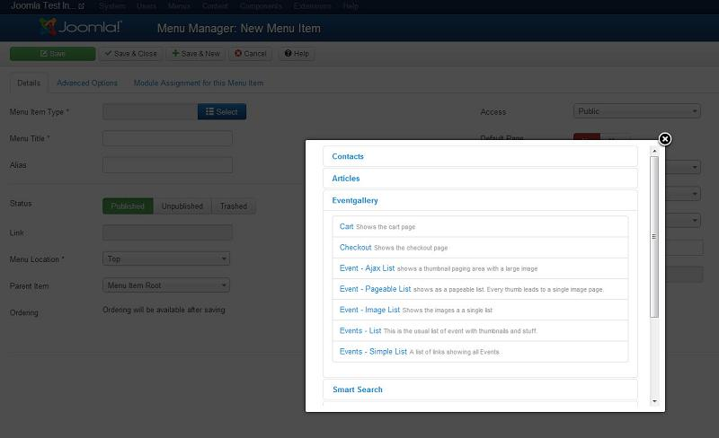
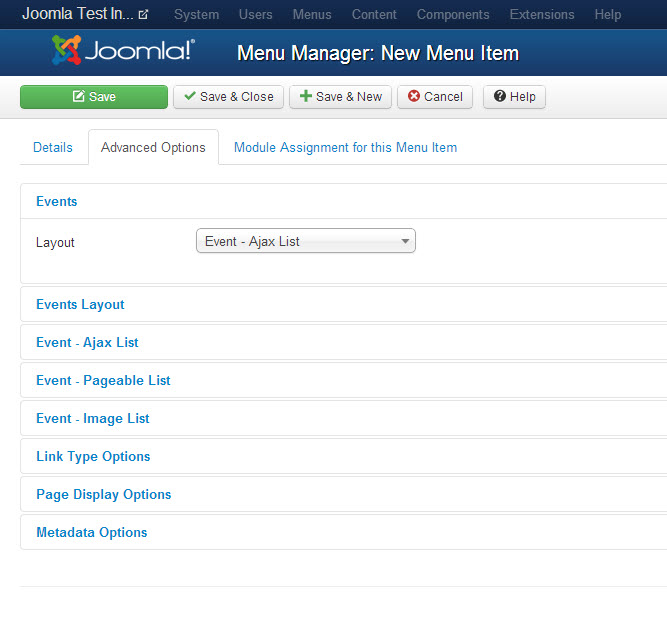
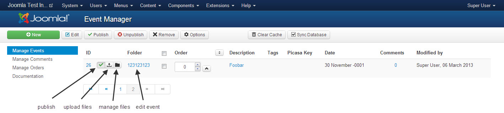
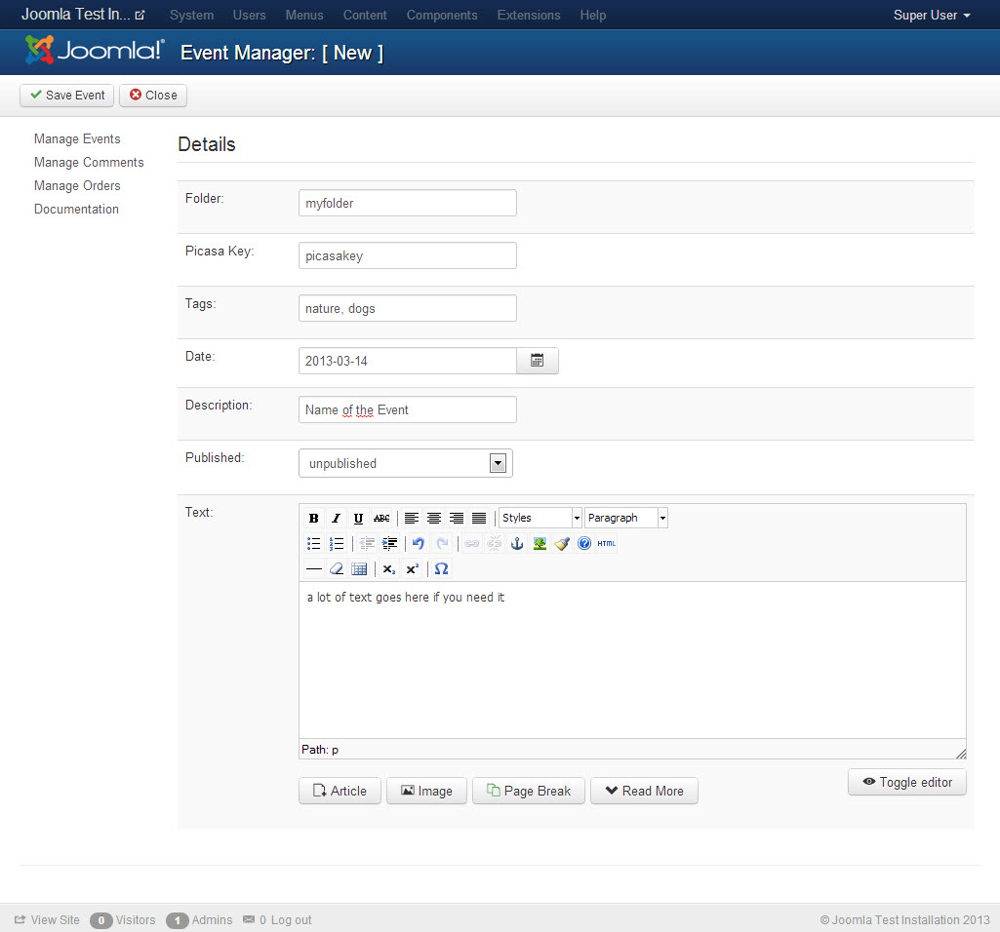
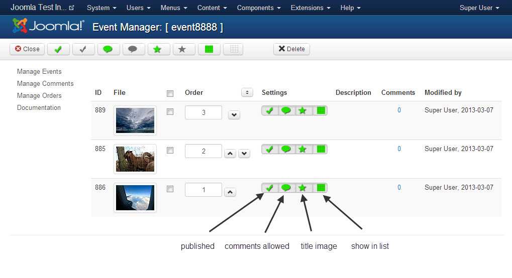
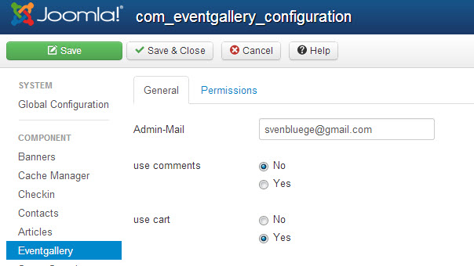
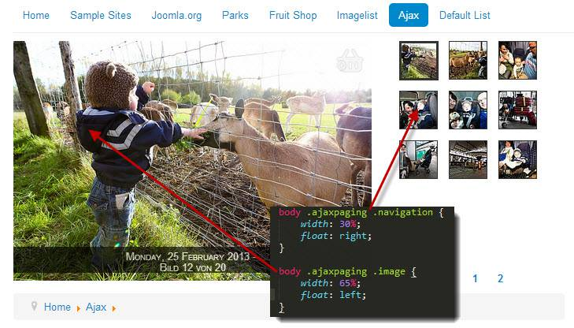

# Event Gallery Intro {#Intro}

It's time to introduce a new gallery component for Joomla. I guess you're already waiting for something like this since there is a real lack of such kind of components ;-)
Initially I build this component to show photos of different events to the audience. To where other components have folders this component calls them events. Because of this this component is called Event Gallery. 

Let's list all the features this gallery component provides:

- works with Joomla 3.0 and Joomla 2.5
- displays images from local folders and **Google Picasa**
- **cart & checkout** to allow the user to create a collection of images and request them from the photographer
- three different views for an image list
	- Image List

		This list type presents all images of an event as a simple long list. You can zoom into images using a lightbox.

	- Page able Image List

		While nearly identical to the Image List view this view provides a paging bar. Instead of opening each photo in a lightbox there is a dedicated page for every image. This page allows you to browser within the current event.

	- Ajax Image List

		If there is limited space the Ajax Image List is for you. It provides a split interface where you have a large image on one side and a pageable list of thumbs on the other side. 
- lightbox with integrated paging and support for *swipe gestures* on mobile

- comments - a user can comment a photo
- **deep links** - you can link from a menu directly to a specific event
- **tags** - you can assign tags to an event and use them to show events with specific tags in your event list only. 
- **responsive support** - the size of a image list changes, it'll recalculate the image layout to fit into the new page width

# Videos {#Videos} 

The following videos will give you a quick introduction of how to set up this component.

Install

<iframe width="420" height="315" src="http://www.youtube.com/embed/f57CA0g08BI?rel=0" frameborder="0" allowfullscreen></iframe>

Create Events

<iframe width="420" height="315" src="http://www.youtube.com/embed/Dcs_baW5x_0?rel=0" frameborder="0" allowfullscreen></iframe>

Create Menu Items

<iframe width="420" height="315" src="http://www.youtube.com/embed/LaoPdMg5pgc?rel=0" frameborder="0" allowfullscreen></iframe>

# Link to the component {#LinkIt}

Creating links to the component is simple. Open the menu manager, create a new menu item and select the right view. The name of the component you want to link to is _Eventgallery_ so choose the right section and the available targets will appear. 

There are several views available:

- Cart

	Shows a page which contains the cart of the current user
	
- Checkout

	Displays the checkout page where the user can request his cart.

- Event - Ajax List

	Shows a specific event with the Ajax List view

	Basic Options
	- _Event_: the event you want to display

	Advanced Options
	- _Number of thumbs per page_ defines how many thumbs you want to see on a page
	- _Number of thumbs on first page_ defines how many thumbs you want to see on the first page. Since there might be some additional text this number can be smaller than on other pages.

- Event - Pageable List

	Shows a specific event with the Pageable List view

	Basic Options
	- _Event_: the event you want to display

	Advanced Options
	- _Height of the thumbnails_ defines the initial height of each row in the grid in pixel.
	- _Height jitter_ defines the maximum amount of pixel the row height can vary.
	- _Height of the first thumbnails_ defines the height in rows of the first photo in the list.

- Event - Image List

	Shows a specific event with the Image List view

	Basic Options
	- _Event_: the event you want to display

	Advanced Options
	- _Height of the thumbnails_ defines the initial height of each row in the grid in pixel.
	- _Height jitter_ defines the maximum amount of pixel the row height can vary.
	- _Height of the first thumbnails_ defines the height in rows of the first photo in the list.

- Events - List

	Displays a list of events. 
	
	Basic Options
	- none

	Advanced Options
	- _Layout_ defines which layout to use for an event. You can configure the appearance of the event page with the options described above.
	- _Intro Text_ defines a text for the events page. Usually displayed on top of the page. 
	- _Tags_ defines which tag a event need to get displayed on this list of events.
	- _Max events on Page_ How many events should we show? If you have 456 and set the number to 20, it'll show only 20. 
	- _Max big events_ Defines who many events we show as big event tiles.
	- _Number of Thumbnails_ how many thumbnails do we want to show per event?
	- _Thumbnail width_ defines the width of a thumbnail for each type of element
	- _Max middle events_ how many of the events should we show medium sized?
	- _Show Thumbnails_ guess what...
	- _show more link_ Show a link to the simple list where show all the available events. 

	
- Events - Simple List

	Displays a list of links to events
	
	- see _Events - List_ for configuration options.

This gallery component supports just a flat list of folders. If you need a navigation tree you're out of luck. But you can achieve a tree structure using tags and Joomla menu items. Create a menu structure which represents the structure you would like to have. Each menu item might link to the view of the event gallery you need. This is simple if you link directly to an event. If you want to have different list you can use tags to separate the lists. 

Example for such a structure: 

- Event1 -> Tags = nature
- Event2 -> Tags = nature
- Event3 -> Tags = architecture
- Event4 -> Tags = people, men
- Event4 -> Tags = people, men
- Event4 -> Tags = people, women
- Event4 -> Tags = people, children

You can arrange the events within the following menu structure:

- Menu Item 1 -> Event List with tag "nature"
- Menu Item 2 -> Event List with tag "architecture"
- Menu Item 3 -> Event List with tag "people"
	- Menu Item 4 -> Event List with tag "men"
	- Menu Item 5 -> Event List with tag "women"
	- Menu Item 6 -> Event List with tag "children"

# Manage Events {#Manage}

The first page you see is the events page. You can manage your events here. Aside of creating a new event you can set an event offline/online, upload files, open the file list and open the edit view. In addition there are two more buttons in the toolbar:

- Sync Database
	
	You can do the upload using FTP or the build in image uploader. Since this component uses the databases to store information about files it needs to be updated once you change something directly at file system level. You can add/remove files and folders. By hitting the sync button added folders and files get added to the database while removed files/folder get removed. Finally the database is in sync with the file system. If you try to upload using FTP put your images into a new folder below  _/images/eventgallery/_

- Clear Cache

	The component caches all calculated images. If you feel you have to clear this cache just hit this button. Keep in mind that refreshing the cache might be expensive. 

## Edit Event {#EditEvent}

The view let's you edit the details of an event. 

- Folder

	Specifies the folders name. If you want to add a Google picasa album, use this syntax user@albumid. Avoid special characters in the folder name. Any name containing an @ will be interpreted as a picasa album. 
	
- Picasa Key

	If you want to include a picasa album which is not public but accessible using a special picasa key, then add this key here.

- Password

	Set a password for each folder if you want to protect it somehow. If a user tries to access such a folder he need to enter a password. If you want to send out links to a password protected folder you can add this password directly to the link and nobody needs to be bothered by a password page. 

- Tags

	A comma separated list of tags you want the event to have.

- Date

	This date is shown in the front end for this event.

- Description

	This description is shown in the front end as the events name.

- Published

	Is this event visible in the front end?

- Cartable
	
	Defines if users can add images from this folder to the cart. Useful if you want to display image where it makes no sense for getting requests for.

- Text

	You can add additional text to an event. This text is usually shown above the thumbnails in the front end.

## Manage Files {#ManageFiles}

Once you created your event and uploaded some photos you may want to manage those files. Here is the right place for it. On this page you can sort, delete and modify the status of an image. If you want to change the title or the description of an image just click on "Title" or "Description" and enter your data to the two fields which appear. Hit the save button to store it in the database.

- published

	Defines if this image appears in the front end.

- comments allowed

	Defines if comments are allowed for this image.

- main image

	Should this image be used for the overview page in the front end? Multiple selections are possible, the image with the highest ranking will win.

- show in image list
	Sometimes you want show an image on the overview page but not in the actual image list. With this option you can hide the image on the list. It'll only appear on the overview page if it is defined as a main image.

The status of an photo can be changed by the button in the status column. By using the check boxes and the buttons in the toolbar you can perform an operation for multiple photos.

## Manage Comments {#ManageComments}

Once somebody added a comment to an image this comment will appear here. You can filter the comments by several attributes, edit and remove them. 

# Configuration options {#configuration}

There are only a few things globally manageable. 

- Admin-Mail

	This address is used to send notification about comment and image request to. Don't forget to and an address here if you activate at least one of the options below. Otherwise your users will see errors while posing comments and requesting images. 

- use comments

	Defines if comments are enabled. 

- use cart

	Defines if the cart functionality is visible in the front end.

# Extend {#Extend}

This section is intended to provide some help with customizations. 

### Modify Ajax List {#ExtensAjaxList}

If you want to display the thumbnails beside the big image you can simply let them float the way you need them. 

# FAQ {#FAQ}

## Thumbs do not show up {#FAQThumbs}

- Error 500: php memory size too low. I have good experience with 128M. Depends on the size of your images
- javascript error occured which prevents the whole site from executing javascript. Without javascript it no image will appear.
- do not use special characters in your file names like Umlaute, +, or things like this. Make your file names safe for the web.
- Error 500: the php function imageconvolution does not work on your server. For now one user reported this using PHP 5.3.8. After commenting out the line of code the gallery worked fine.

# Event Gallery Release Notes {#ReleaseNotes}

	Author: Sven Bluege
	Mail: svenbluege@gmail.com
	Web: http://www.svenbluege.de

## 2.6.2

	- New Features
		- ajax list: thumb size is configurable
		- configuration to show/hide exif information in descriptions
		- you can target (and therefore hide) each button of the navigation bar on the single image page using CSS

	- Bug fixes
		- tag support: menu item for the event list can define a comma or space separated list of tags

## 2.6.1

	- New Features
		- added management for titles and captions for each file
		- lightbox is now capable to handle text which contains not just three words
		- documentation update

	- Bug fixes
		- fixed German language in Ajax list (Bild 1 von 10)
		- fixed HTTP 500 caused by large log file containing for Picasa access requests. 
		- fixed SEO urls when appending a suffix like .html to every url.
		- fixed adding comments. 
		- fixed enlargement of images because of JavaScript calculations
		- fixed hiding of navigation buttons in single image view if the last / first image is shown.
		- fixed blue background in Ajax view with J2.5 default template
		- fixed issue with lightbox and some url encoding. Lightbox opened but no image appeared. 

## 2.6.0

	Initial public release